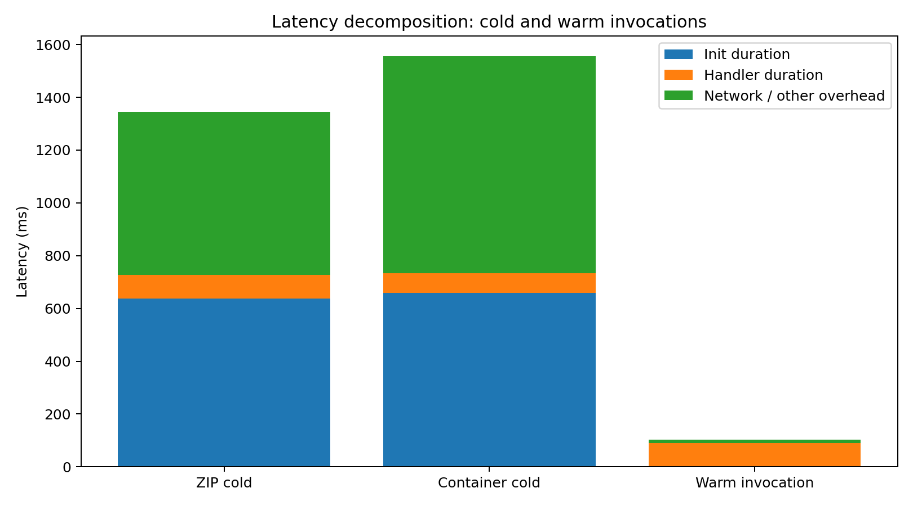
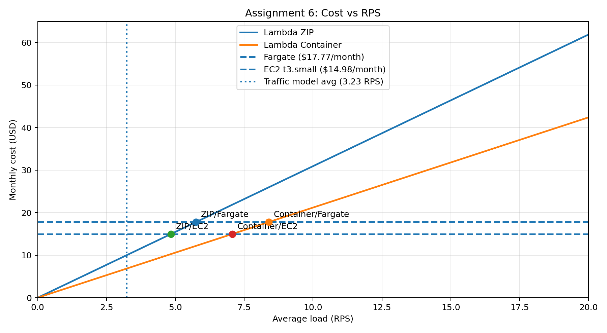

# AWS Cloud Lab — Serverless vs Containers: Latency and Cost Comparison

## Assignment 1 – Deployment Verification

All four environments were successfully deployed:
- AWS Lambda (ZIP)
- AWS Lambda (container image)
- AWS Fargate
- EC2 instance

All endpoints returned identical k-NN results for the same query vector.
All experiments were conducted in us-east-1.

Terminal output confirming this is saved in:
`results/assignment-1-endpoints.txt`

## Assignment 2: Scenario A – Cold Start Characterization

### Results

| Deployment | Cold latency (ms) | Warm p50 (ms) | Init Duration (ms) | Handler (ms) |
|-----------|------------------|--------------|-------------------|-------------|
| Lambda ZIP | ~1344 | ~103 | ~620–650 | ~80–95 |
| Lambda Container | ~1555 | ~341 | ~550–640 | ~75–90 |

### Analysis

Cold start latency is dominated by initialization time (~600 ms), which significantly exceeds handler execution time (~80–95 ms).

Both ZIP and container deployments show similar behavior, indicating that container packaging does not eliminate initialization overhead.

ZIP deployment shows significantly lower warm latency (~103 ms) compared to container (~341 ms).

Cold start latency can be decomposed into:
- Initialization time
- Handler execution
- Network overhead

## Assignment 3: Scenario B – Warm Throughput

### Results

| Environment | Concurrency | p50 (ms) | p95 (ms) | p99 (ms) | Server avg (ms) |
|------------|------------|---------|---------|---------|----------------|
| Lambda ZIP | 5  | 356.2 | 423.9 | 634.5 | 119.163 |
| Lambda ZIP | 10 | 360.0 | 443.6 | 653.1 | 119.163 |
| Lambda Container | 5  | 348.5 | 418.4 | 620.2 | 74.107 |
| Lambda Container | 10 | 346.8 | 423.0 | 661.8 | 74.107 |
| EC2 | 10 | 398.0 | 454.9 | 483.2 | 23.43 |
| EC2 | 50 | 834.3 | 1009.9 | 1109.0 | 23.43 |
| Fargate | 10 | 808.5 | 1083.4 | 1313.3 ⚠ | 24.001 |
| Fargate | 50 | 4205.2 | 4512.4 | 4680.6 ⚠ | 24.001 |

### Analysis

Lambda shows stable latency across concurrency levels (c=5 vs c=10), with p50 remaining around 350 ms for both ZIP and container deployments. This is because each request is handled by an independent execution environment, eliminating queueing effects.

In contrast, EC2 and Fargate exhibit clear signs of queueing under higher load. For EC2, p50 increases from 398 ms (c=10) to 834 ms (c=50), while p99 grows to over 1100 ms. Fargate shows even more dramatic degradation: p50 increases from 808 ms (c=10) to over 4200 ms (c=50), indicating severe request queueing.

Cells marked with ⚠ indicate cases where p99 > 2× p95, signaling unstable tail latency. This effect is visible for Fargate at both concurrency levels.

The difference between server-side `query_time_ms` (23–119 ms) and client-side latency (300–4000 ms) is caused by:
- network round-trip time (RTT)
- TLS handshake overhead
- request queueing under load

This explains why client-side latency is significantly higher than actual computation time.

## Assignment 4: Scenario C – Burst from Zero

### Results

| Environment | p50 (ms) | p95 (ms) | p99 (ms) | max (ms) |
|------------|---------|---------|---------|---------|
| EC2 | 935.4 | 1846.6 | 2233.5 | 2259.5 |
| Lambda Container | 362.2 | 1587.8 | 1644.6 | 1677.6 |
| Lambda ZIP | 366.3 | 1744.1 | 1925.4 | 1925.7 |
| Fargate | 4001.1 | 4927.2 | 5372.1 | 5491.0 |

### Cold Starts

- Lambda ZIP: 10  
- Lambda Container: 10  

### Analysis

Lambda shows a bimodal latency distribution:
- warm requests ≈ 350 ms
- cold-start requests ≈ 1500–1900 ms

EC2 and Fargate suffer from queuing delays under burst load.

None of the environments meet the SLO (p99 < 500 ms).

## Assignment 5 – Cost at Zero Load

| Environment | Monthly Idle Cost |
|------------|------------------|
| Lambda | $0 |
| Fargate | ~$13.34 |
| EC2 | ~$11.23 |

Screenshot evidence location:
`results/figures/pricing-screenshots`

### Analysis

Lambda incurs zero cost at idle because it is fully event-driven.

Fargate and EC2 incur continuous costs even when no requests are processed, as resources remain provisioned.

Idle cost is calculated assuming 18 hours/day with no traffic, as specified in the traffic model.

## Assignment 6 – Cost Model and Recommendation

### Traffic Model

- Peak: 100 RPS (30 minutes/day)
- Normal: 5 RPS (5.5 hours/day)
- Idle: 18 hours/day

Total monthly requests:
≈ 8.37 million

### Lambda Cost Calculation

For the recommendation below, I use the measured server-side execution time for **Lambda ZIP** from Scenario B as the execution-time estimate:
- duration = 0.119 s
- memory = 0.5 GB

GB-seconds:
8.37M × 0.119 × 0.5 ≈ 498,602

Costs:
- Requests: ≈ $1.67
- Compute: ≈ $8.32

Total:
≈ **$9.99/month**

### Always-On Cost (Fargate and EC2)

Fargate (0.5 vCPU, 1 GB):
Hourly cost:
0.5 × $0.04048 + 1 × $0.004445 ≈ $0.024685

Monthly cost:
0.024685 × 24 × 30 ≈ **$17.77/month**

EC2 (t3.small):
Hourly cost: $0.0208

Monthly cost:
0.0208 × 24 × 30 ≈ **$14.98/month**

### Break-even Analysis

Lambda cost per request:
≈ $0.00000119

Monthly requests for 1 RPS:
≈ 2,592,000

Lambda monthly cost:
≈ 3.09 × R

Break-even with Fargate:
17.77 / 3.09 ≈ **5.75 RPS**

Traffic-model average load:
≈ **3.23 RPS**

### Cost Comparison

- Lambda ZIP: ~$9.99/month
- EC2: ~$14.98/month
- Fargate: ~$17.77/month

## Final Recommendation

Recommended environment: **AWS Lambda (ZIP deployment)**

### Justification

- No idle cost during long inactive periods (18 hours/day)
- Automatic scaling fits bursty workload pattern

### Limitations

Lambda does not meet the SLO (p99 < 500 ms) under burst conditions due to cold starts.

### Improvements

To meet SLO:
- use Provisioned Concurrency to eliminate cold start latency

### When Recommendation Changes

Switch to EC2 or Fargate if:
- average load exceeds ~6 RPS
- traffic becomes stable (no long idle periods)
- provisioned concurrency cost exceeds always-on infrastructure cost

## Final Conclusion

- Lambda provides the best cost efficiency for bursty workloads
- EC2 provides the best latency stability
- Fargate is the least efficient in this configuration
- None of the environments meet the SLO without additional tuning